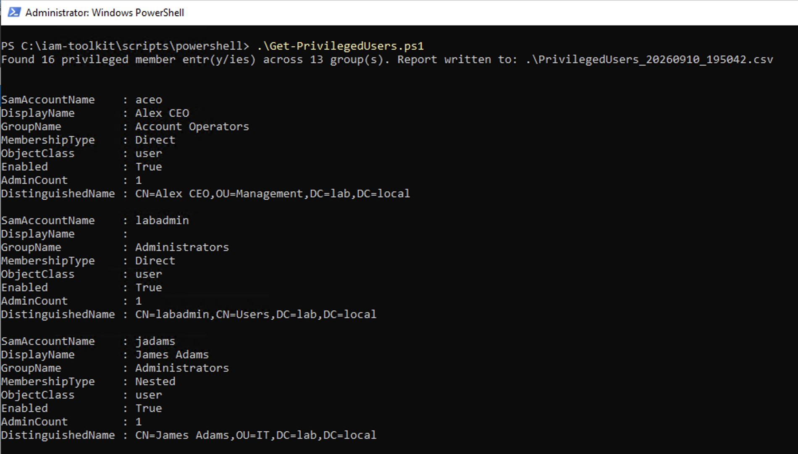
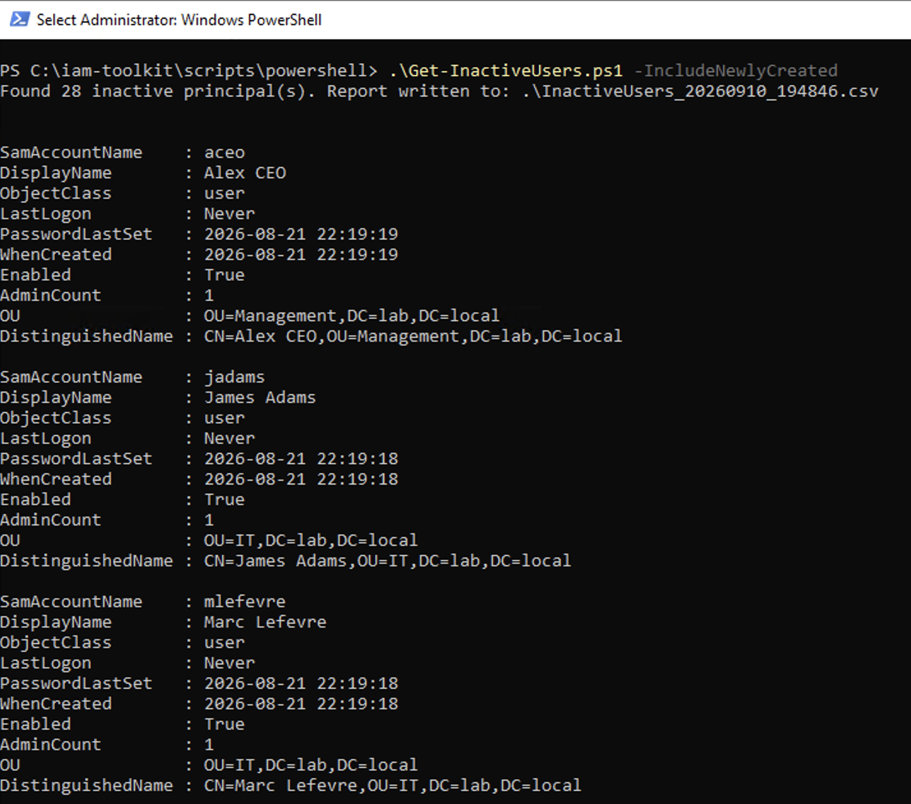
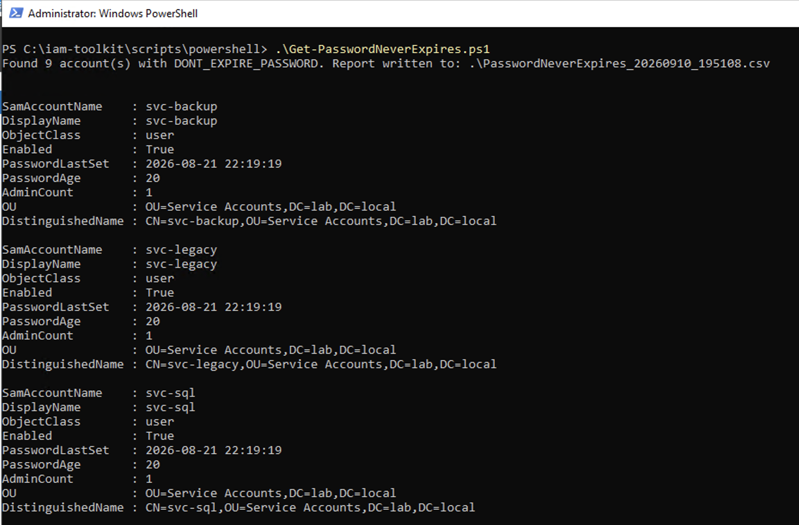

# IAM Toolkit

A practical toolkit to audit Identity and Access Management risks in Active
Directory environments.

It bundles three things:

- PowerShell scripts that detect common IAM misconfigurations in Active Directory
- A reproducible lab environment to exercise them end to end
- An audit methodology and a worked sample report

Built for IAM consultants, internal auditors, and sysadmins who need a quick,
repeatable way to surface identity hygiene issues in an AD domain.

## See what it produces

**[Read the sample audit report →](reports/sample-audit-report.md)**

A full audit pass run against the reproducible lab: four severity-graded findings,
each with the attack mechanism spelled out, a remediation, and an effort estimate.
The stated limits of the audit are part of the report.

The methodology behind it is documented in
[`docs/audit-methodology.md`](docs/audit-methodology.md) — how results are
cross-referenced, how severity is decided, and why tooling has to be validated
against a real directory before its output is trusted.

## What it detects

| Script | What it finds |
|---|---|
| `Get-InactiveUsers.ps1` | Enabled accounts with no recent logon activity |
| `Get-PrivilegedUsers.ps1` | Members (direct and nested) of sensitive AD groups |
| `Get-PasswordNeverExpires.ps1` | Accounts flagged with `PasswordNeverExpires` |

Each script writes a CSV ready to be reviewed, filtered, or fed into a report.



<details>
<summary>Console output of the two other scripts</summary>





</details>

Sample CSV output from a real lab run is in
[`outputs/sample-results/`](outputs/sample-results/).

## Quick start

```powershell
# Accounts inactive for more than 90 days
.\scripts\powershell\Get-InactiveUsers.ps1 -DaysInactive 90 -OutputPath .\outputs\inactive.csv

# Members of sensitive groups, direct and nested
.\scripts\powershell\Get-PrivilegedUsers.ps1 -OutputPath .\outputs\privileged.csv

# Enabled accounts with non-expiring passwords
.\scripts\powershell\Get-PasswordNeverExpires.ps1 -OutputPath .\outputs\pwd-never-expires.csv
```

Every script supports `-OutputPath` and ships with comment-based help
(`Get-Help .\Get-InactiveUsers.ps1 -Full`). The `.NOTES` block of each script
documents the threat model behind every detection, not just its parameters.

## Requirements

- Windows Server with the Active Directory PowerShell module (`RSAT-AD-PowerShell`)
- An account with read access to the directory
- PowerShell 5.1 or later

## Lab environment

The `lab/` directory contains everything needed to build a Windows Server domain
seeded with deliberate misconfigurations, so the scripts can be validated against
a state whose expected output is known in advance.

- [`lab/lab-setup.md`](lab/lab-setup.md) — building the DC from scratch, on a
  hypervisor or on Azure, with the gotchas specific to each
- [`lab/seed-test-users.ps1`](lab/seed-test-users.ps1) — populates the domain with
  31 users and clustered misconfigurations (idempotent)
- [`lab/lab-scenarios.md`](lab/lab-scenarios.md) — the 14 scenarios the lab
  simulates, each with its real-world context, threat model, and remediation

## Repository layout

```
iam-toolkit/
├── scripts/powershell/ # Detection scripts
├── lab/ # Reproducible AD lab + seed script
├── docs/ # Audit methodology
├── outputs/sample-results/ # Sample CSV output (lab data only, never real)
└── reports/ # Sample audit report
```

## Roadmap

- **Phase 1 — complete.** Detection scripts, reproducible lab, seeded fixtures,
  threat-model catalogue.
- **Phase 2 — complete.** Lab validated against a live domain, sample outputs,
  sample audit report, methodology guide. Tagged `v1.0.0`.
- **Phase 3 — next.** `Get-KerberosRisks.ps1`: unconstrained and constrained
  delegation, resource-based constrained delegation, kerberoastable privileged
  accounts. Lab extension to match.
- **Phase 4.** Packaging as an "IAM Health Check Kit" for external use.

## License

MIT — see [LICENSE](LICENSE).

## Contributing

Issues and pull requests are welcome. See [CONTRIBUTING.md](CONTRIBUTING.md)
before submitting changes.
